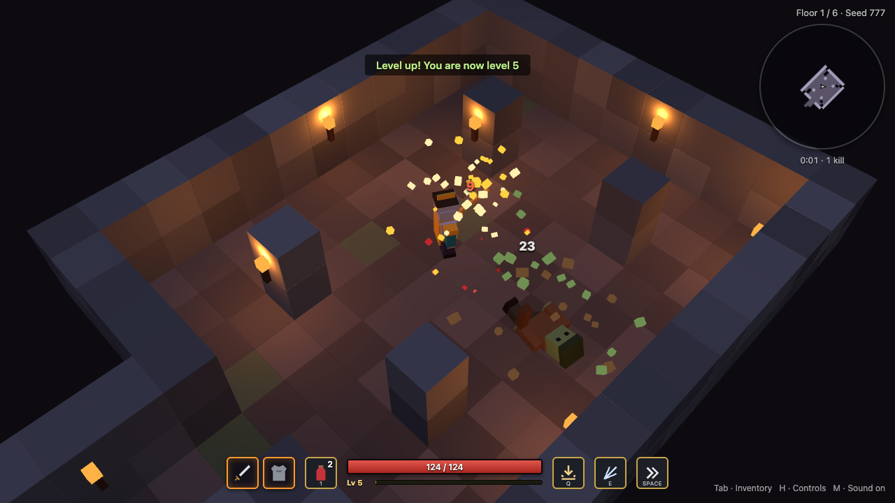
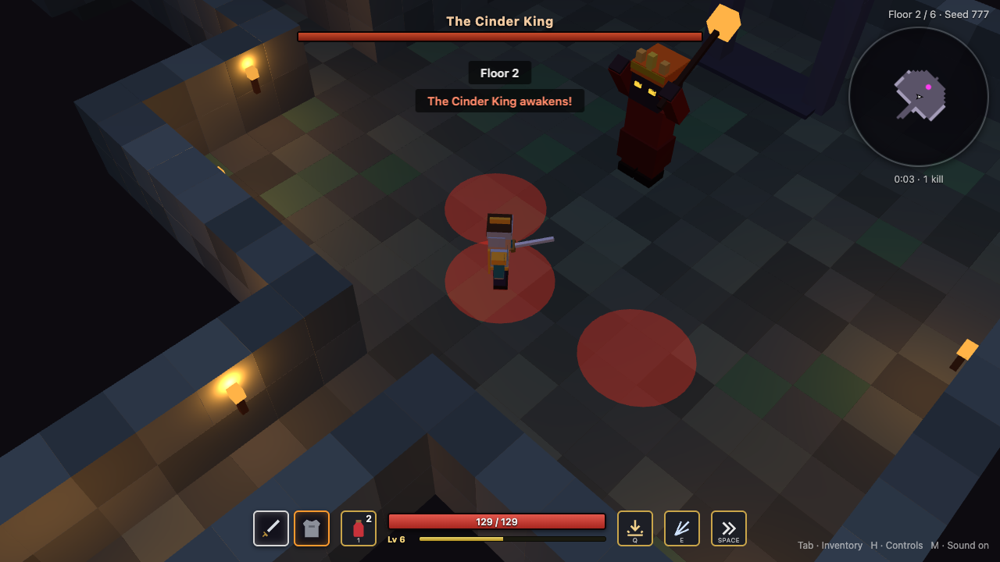
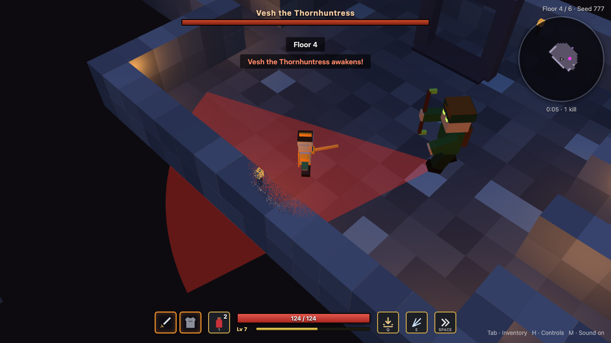
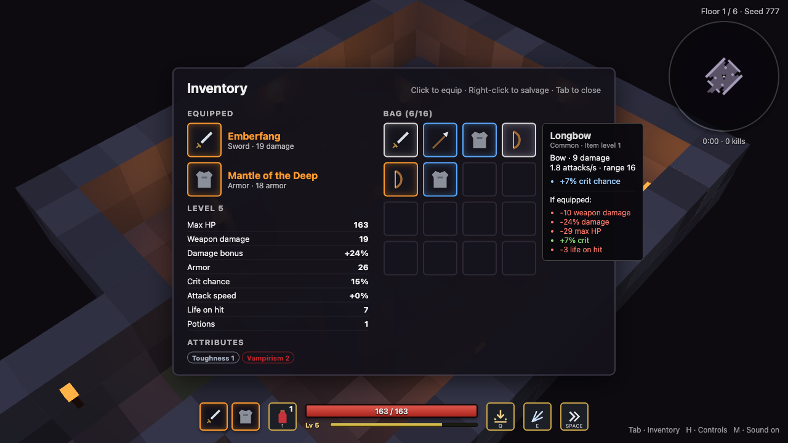
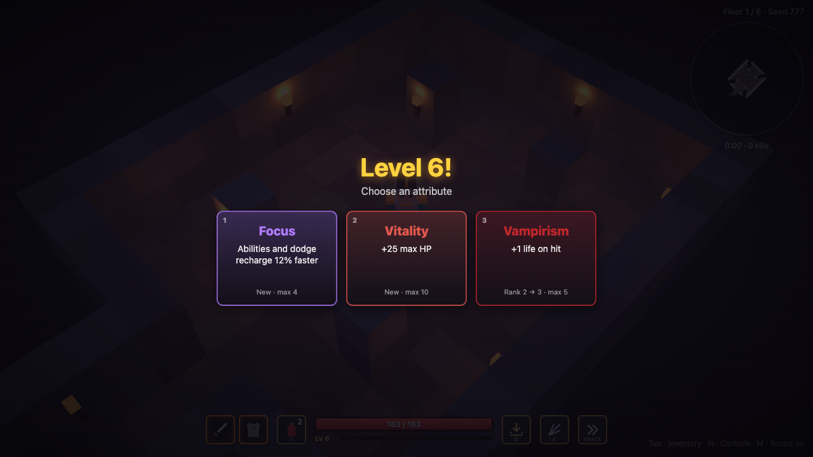

# Voxel Dungeon

A dungeon crawler that runs in the browser, built entirely from coloured cubes. Fight through six procedurally generated floors, collect loot, choose how your character grows, and defeat a different boss on each floor.

Nothing is pre-made: dungeon layouts, character models, loot and sound effects are all generated in code. The repo contains no image or audio assets.




## Features

- **Six procedurally generated floors**: rooms and corridors with their own colour theme on each floor. A seed always rebuilds the same dungeon.
- **Four bosses** with telegraphed attacks and an enraged phase below half health.
- **Real-time combat**: mouse-aimed melee and bow attacks, a dodge roll with brief invulnerability, a ground slam, an arrow volley and health potions.
- **Loot** in three rarities (common, rare, unique) with random stat modifiers. Your equipped armor and weapon show on your character.
- **Level-up choices**: each level pauses the game and offers three random attributes to pick from.
- **Game feel**: particles, floating damage numbers, screen shake, a fog-of-war minimap, and sound effects synthesised in the browser.

## Screenshots

| | |
| --- | --- |
|  |  |
| *The Cinder King marks where his bombs will land.* | *Vesh the Thornhuntress telegraphs an arrow fan.* |
|  |  |
| *Hover an item to compare it with your gear.* | *Pick one of three attributes on each level-up.* |

## Getting started

You need [Node.js](https://nodejs.org/) 22.12 or newer.

```sh
npm install
npm run dev
```

Then open http://localhost:5173. Click in the game window or press any key to enable sound.

To play a specific dungeon, add a seed to the URL, for example `http://localhost:5173/?seed=12345`. The same seed always produces the same floors, bosses and level-up offers.

To make a production build:

```sh
npm run build      # type-check and build to dist/
npm run preview    # serve the build locally
```

`dist/` is a static site, so you can host it anywhere that serves static files.

## Controls

| Key | Action |
| --- | --- |
| W A S D | Move |
| Mouse | Aim |
| Left click | Attack (hold to keep attacking) |
| Space | Dodge roll, with brief invulnerability |
| Q | Ground slam (area damage) |
| E | Arrow volley (7-arrow spread) |
| 1 | Drink a health potion |
| 1 / 2 / 3 | Pick an attribute on the level-up screen |
| Tab / I | Inventory (pauses the game) |
| H | Controls overlay (pauses the game) |
| M | Mute / unmute |
| F3 | FPS and draw-call meter |
| R | Restart after death |

## How a run works

Each floor is a set of rooms joined by corridors, ending in a boss arena. Killing the boss opens a portal to the next floor, and clearing all six wins the run. Enemies get tougher the deeper you go.

**Enemies.** Grunts close in for melee, archers keep their distance and shoot, and exploders rush you and detonate.

**Bosses.** Every big attack is marked on the ground in red before it lands.

| Boss | Fighting style |
| --- | --- |
| The Ashen Colossus | Ground slams, charges, and summons helpers when hurt. |
| Vesh the Thornhuntress | Stays at range, fires arrow fans and rapid shots, and dashes away if you close in. |
| The Cinder King | Drops bombs on marked spots around you and blasts a fire nova if you get close. |
| The Hollow Lich | Raises minions, fires bolt fans and rings, and teleports away when cornered. |

Floor 1 is always the Colossus, and floors 2–4 bring the other three in an order set by the seed. Floors 5 and 6 are rematches against two different bosses.

**Loot.** Enemies and chests drop swords, spears, bows, armor and potions. Rarer items have more stat modifiers. Your equipped gear appears on your character (leather, chain or plate, with rarity-coloured trim) and in the HUD.

**Leveling.** Kills give XP. Each level-up fully heals you and lets you choose one of three random attributes, such as max HP, damage, crit chance, attack speed or faster cooldowns. Each attribute has a maximum rank.

## Development

```sh
npm run lint && npm run typecheck && npm test   # run before every commit
npm run smoke                                    # headless browser test
```

- **Unit tests** (`npm test`, Vitest) cover the pure game logic: dungeon generation and boss order, the collision grid, damage formulas, loot rolls, inventory, leveling and attribute picks, pathfinding, the fixed-step clock and minimap exploration.
- **Smoke test** (`npm run smoke`) starts the dev server and plays the game in headless Chromium with Playwright. It checks movement, combat, every enemy type, all six floors and their bosses, loot, inventory, abilities, level-ups, effects and the HUD. It fails on any console error or warning, and saves screenshots to `smoke-out/`. Install the browser once with `npx playwright install chromium`.

### Project layout

```
src/
  core/      Game loop, fixed-step clock, input, seeded RNG, event bus, camera rig
  world/     Dungeon generator, tile grid and collision, voxel level builder, torches, fog of war
  entities/  Player and gear models, enemies, bosses (bosses/), chests, pickups, portal
  systems/   Damage, loot, inventory, leveling, attributes, projectiles, pathfinding, particles, audio
  ui/        HUD, minimap, inventory, level-up screen, damage numbers, FPS meter
tests/       Vitest unit tests
scripts/     Playwright smoke test
docs/        README screenshots
```

### How it's built

- **Game logic is separate from rendering.** Generation, loot, damage and progression don't import three.js, so they're tested without a browser.
- **Seeded randomness.** A mulberry32 RNG derives every floor, its boss and the level-up offers from the run seed.
- **Grid collision.** Characters are circles that slide along wall tiles; there's no physics engine.
- **Fixed timestep.** The simulation runs at 60 Hz regardless of screen refresh rate. The camera, particles, damage numbers and minimap update every rendered frame.
- **Event-driven effects.** The simulation emits events (`hit`, `enemyDied`, `explosion`, ...). Sound, particles, damage numbers, screen shake and messages listen for them and never change game state.
- **Cheap rendering.** Level geometry is one instanced mesh per material, and all particles share a single pooled instanced mesh. A small pool of point lights follows the torches nearest the player. If the frame rate stays below 45, the renderer lowers its resolution.
- **Synthesised audio.** Sound effects are built from Web Audio oscillators and filtered noise. Audio starts on the first key press or click, as browsers require.
